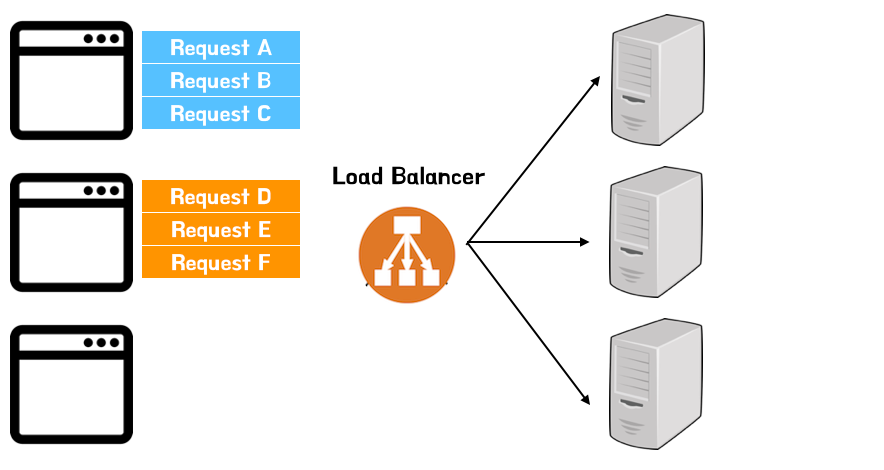
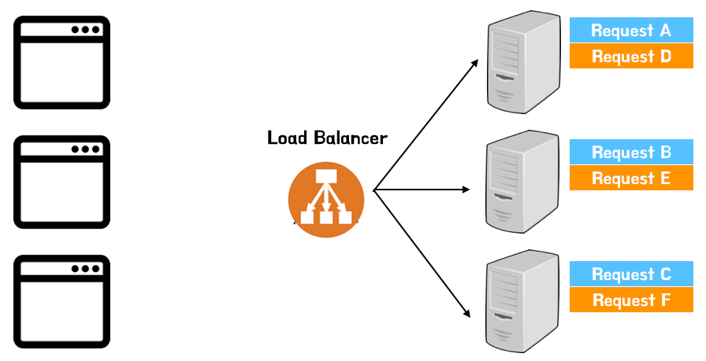

# Introduce
BSS 과금 시스템을 위한 각 개별 서비스들의 Session 저장/관리에 대한 개발/운영의 비효율성을 개선하기 위해 Cloud Session Managemente 환경에서 공통으로 세션 관리할 수 있는 인터페이스를 제공을 목표로 합니다. 이를 위해 Cloud 환경에서 Sticky Session, Distributed Session 2가지 인터페이스를 활용한 세선 저장/관리 방안을 제공합니다. 이를 통해 웹서버의 부하/분산에 따른 오토스케일링 환경에서도 일관된 세션 정보를 관리/유지 가능하고, 중요 세션 정보를 Cloud Managed DB Service (ex: Redis, MongoDB) 를 활용하여 성능/보안에 최적화된 환경에서 공통 세션 관리를 위한 API 인터페이스를 통해 효율적인 세션 관리 방안을 제공합니다.

# Requirements
- [Google Docs 참고](https://docs.google.com/spreadsheets/d/1PWpsrKVgHGhqS6xmO8hNJFDG6Hexc8ZxB1ZsZwWSPCY/edit#gid=188560468)

# Features
### Security
  - Authentication
    - Congnito (/w LDAP) 연동을 통한 사용자 인증 (Cognito User Pool)
    - MFA (Multi Factor Authentication) 인증 적용을 통한 보안 강화
  - Authorization
    - 서비스별 권한 그룹 생성/분리 (ex: Admin, Dev)
    - Cloud 리소스 접근 권한 관리 (/w Congniro Identity Pool)
  - Access Control
    - RBAC 접근권한 관리
    - Network Access Control (내/외부 IP/Port, Service Domain)
  - Session Encryption
    - AWS KMS(Key Management System)을 이용한 키 관리 및 암호화 알고리즘 적용

### Session Management
  * Sticky Session
    - 고정된 Web Server 제공 (Load Balancer Generated Cookie Stickiness 옵션)
    - Auto-Scaling 과정에서 세션 유지방안 제공 (Scale-in 과정에서 Session Clustering 제공방안 검토 필요.)
  * Distributed Session
    - Cloud Managed Service (Redis, MongoDB) 분산 DB를 이용한 공통 세션 저장공간 제공
    - Session Clustering 기능 제공
    - Web Server 장애 또는 오토스케일링 과정에서의 세션 손실 방지

### Sesesion Module
  * API
    - API 인터페이스를 통한 Session Management 제공
    - Multi API 지원 (REST, GraphQL, gRPC ..)
  * SDK
    - Multi SDK 지원 (API 대체 검토)

### DevOps
  * Automation
    - 인프라 자동화 (Terraform, aws-cli, aws-sdk)
  * Monitoring
    - AWS Resource Metric 주요 KPI 모니터링 (CPU, Disk, Memory, Network)
    - Health Check (Readness/Liveness)
  - Gitops
    - Secret Config
    - CI/CD

# Session Management

## Sticky Session

#### Workflow

1. blabla1
1. blabla1
1. blabla1

1. blabla1
1. blabla1
1. blabla1

## Distibuted Session

# Cloud Architecture

# Ref
- [ALB Sticky Session](https://docs.aws.amazon.com/elasticloadbalancing/latest/application/sticky-sessions.html)
- [Sticky Session & Session Clustering](https://smjeon.dev/web/sticky-session/)
